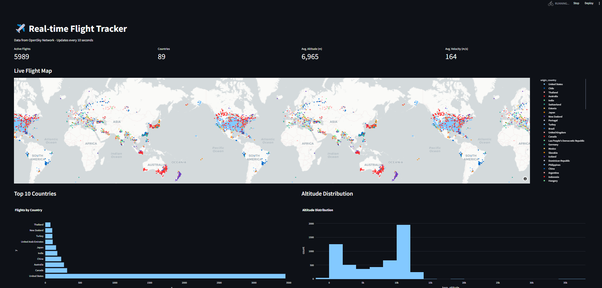

# Sistema de Monitoreo de Aviones en Tiempo Real

**Adrian Hernández Santos - C411**

## Descripción
Este proyecto implementa un sistema de monitoreo de aviones en tiempo real utilizando datos de la API de OpenSky Network. El sistema está construido sobre una arquitectura de big data que utiliza Apache Kafka para el procesamiento de datos en tiempo real y Hadoop para el almacenamiento de los datos en HDFS.

## Modelación
Se decide hacer uso de dos de las principales herramientas de procesamientos de grandes volúmenes de datos que son Kafka y Hadoop, las cuales proveen un manejo óptimo de dicho procesamiento e interfaces sencillas de implementar y utilizar para facilitar dichas tareas. Cada cierto tiempo, se piden los datos de los estados de los aviones conocidos y monitoreados por OpenSky para extraer métricas y hacer procesado de dichos datos. En este caso específico se muestra un mapa con la posicion en tiempo real de dichas aeronaves, clasificando por color los tipos de naves. También se muestra un conjunto de estadísticas y métricas que ayudan a visualizar y estimar el comportamiento global de la red de transporte aéreo.
Se agregó ademas un conjunto de estadisticas sobre los retrasos de los vuelos y rankings de aeropuertos segun sus vuelos con retrasos. Dichos retrasos se clasificaron por su severidad en magnitud de tiempo y se agregaron gráficas para ver la distribución de dicha severidad entre todos los vuelos afectados.

## Arquitectura
El sistema está compuesto por tres componentes principales:

1. **Productor (producer.py)**
   - Se conecta a la API de OpenSky Network
   - Recopila datos de aviones cada 10 segundos
   - Envía los datos a un topic de Kafka
   - Implementa compresión gzip para optimizar el uso de recursos

2. **Consumidor (consumer.py)**
   - Consume datos del topic de Kafka
   - Procesa y almacena los datos
   - Genera visualizaciones en tiempo real
   - Soporta almacenamiento tanto local como en HDFS

3. **Dashboard (dashboard.py)**
   - Interfaz web interactiva construida con Streamlit
   - Muestra métricas en tiempo real
   - Visualiza la posición de los aviones en un mapa
   - Presenta gráficos y estadísticas

## Ejemplo de visualización

## Conclusiones
En este proyecto se han aplicado los conocimientos adquiridos en el curso de Procesamiento de Grandes Volúmenes de Datos (Big Data), los cuales son útiles en diferentes áreas en las que podemos mencionar como notorias la Ciencia de Datos, la Estadística y en general cualquier rama que requiera trabajar con una gran cantidad de datos con tiempos de actualización cortos y necesidad de latencia mínima para su procesado en tiempo real. Las herramientas utilizadas han sido de gran ayuda y conocer su funcionamiento ha sido clave para la solución del problema planteado.